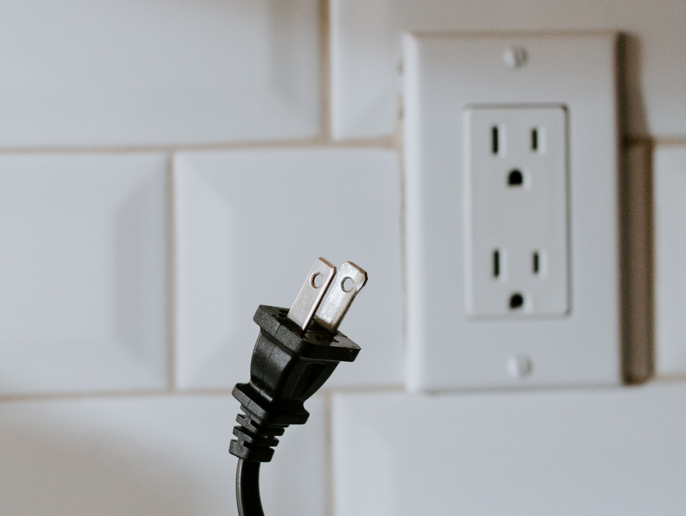

## Objectif

Obtenir tous les éléments et conseils d'un professionnel me permettant la réalisation du besoin décrite ci-après pour un budget d'environ 2000 euros.

Je ne sais pas si j'ai les moyens pour un onduleur Victron Multi plus II (le modèle 24V 3000VA ). De plus, il semble qu'il nécessite d'avoir un chargeur séparé.

Je n'ai clairement pas les moyens pour des batteries Ni-Fe (vu les prix que Perma-batteries m'a donnés),

- Mais je ne souhaite pas utiliser la techno Gel ou OPZS,
- Donc ça laisse uniquement les LiFePO4.

## Besoin

Alimenter au minimum un poêle à granulé Ravoli HR70 de fin septembre à début mai qui consomme :

- 480-520W de puissance au démarrage (12 premières minutes)
- puis 25-120W en fonctionnement nominal (pendant environ 17h, au plus froid de l'hiver,
  - la visse sans fin fait monter la puissance à 120W pendant 5 sec toute les 30-40secs,
  - puis la puissance instantannée retombe à 25W),

Soit environ 750W / j.

J'aimerai une autonomie de 1 à 2j.

Donc, si j'ai bien compris, il faut une batterie de 750 x 1.2 (DOD = 80%) = 900Wh / j, soit :

- 2 batteries de 75Ah en 12V
- 2 batteries de 40Ah en 24V

Je n'exclus d'alimenter d'autres appareils, comme :

- les lumières (23 LED de max. 4W) où on en utilise 10 de 4W plus que les 13 autres, soit :

  - 4Wh x 10 x 6h = 240Wh / j
  - 4Wh x 13 x 2h = 104Wh / j

- et une VMI avec filtre (600 Wh / 24h mesurés).

Donc, une batterie de 2KWh (type : Polyntech) de capacité donnerait 1 j à 2 j d'autonomie selon notre usage.

Un bonus non négligeable : permettre le chargement des batteries sur notre surplus solaire (ou une piste pour câbler cela). Cf. schéma de l'installation PV actuelle ci-jointe.

## Questions

**[ ] Question 1 :** pour mon besoin, faut-il privilégier un onduleur hybride (ex : onduleur Victron Multi plus II) séparé du chargeur de batterie ? ou faut-il choisir un onduleur / chargeur (ex : CONVERTISSEUR-CHARGEUR 12V/230V MULTI 1200VA/50-16) ?

**[ ] Question 2 :** en dehors de l'avantage "plus la tension est haute = plus le câblage est petit", que faut-il privilégier : 12V, 24V ou 48V ?

**[ ] Question 3 :** que suggérez-vous pour mon besoin pour au moins faire tourner le poêle à granulés pendant minimum 1 jour et jusqu'à 2 jours si possible dans le budget ?

**[ ] Question 4 :** Sur le site wattuneed, la fiche produit "Pylontech US2000" dit "Capacité de stockage recommandée". Que cela signifie-t-il ?

**[ ] Question 5 :** Combien de Wh puis-je connecter réellement sur l'onduleur ?

**[ ] Question 6 :** Comment adapter mon installation PV autoconsommation actuelle (voir schéma ci-joint) ? Que me manque-t-il en équipement / matériel ?

**[ ] Question 7 :** La Pylontech indique 90% DOD et plus de 6000 cycles à 80%. Si j'utilise 80% de la capacité de la batterie chaque jour, cela donne une durée de vie de 16.43 ans ? Et dans la réalité, qu'en est-il ? Quels sont les retours d'expérience des utilisateurs de cette batterie depuis 4-5 dernières années ?

Credits: [Photo de Kelly Sikkema sur Unsplash](https://unsplash.com/@kellysikkema?utm_source=unsplash&utm_medium=referral&utm_content=creditCopyText).
